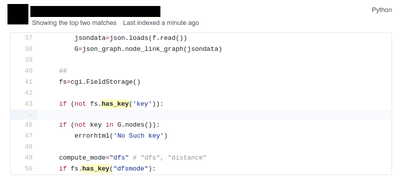
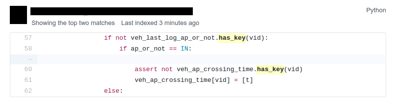

:css: css/stylesheet.css
:skip-help: true
:title: Prehistoric Patterns in Python
:auto-console: false

.. header::

    .. image:: images/shoobx.png

----

Prehistoric Patterns in Python
==============================

.. class:: name

    Lennart Regebro

PyCon US 2017, Portland

.. note::

    Hi! So yes, I'm Lennart Unpronouncable, I've been working with Python
    fulltime since 2001.

----

.. image:: images/magda_elenor.jpg
    :class: left
    :width: 70%

.. image:: images/elenor_quince.jpg
    :class: right
    :width: 29.5%

.. image:: images/cats.jpg
    :class: left
    :width: 50%

.. image:: images/quince.jpg
    :class: right
    :width: 50%

.. note::

    I'm born in Sweden, but I live in Poland, with my
    wife, daughter, cats and fruit trees.

----

.. class:: blurb

    Shoobx is the only comprehensive platform for incorporation, employee
    onboarding, equity management, fundraising, board & stockholder
    communication, and more.

.. note::

    I work for Boston company Shoobx. We make a webapp that helps you with a
    lot of the legal documentation for corporations.

    If you don't understand what that elevator blurb says, don't worry about
    it, your bosses will. Tell them about us.

    But enough about me!

----

.. image:: images/python-logo-0.png
    :class: left
    :width: 10%

>>
==

.. image:: images/python-logo-2.png

.. note::

    This talk is going to be about old code patterns.

    Because has Python gained more features, so some things we used to do
    make no more sense. But there is loads of old code out there, so I will
    try to explain why that old code looks like it does.

    And old does not mean unmaintained. If you wrote a library that needed to
    support Python 2.4 old patterns may very well remain, because they still
    work. So you might very well encounter this in maintained code.

    And, old tutorials and old books have old patterns. And people keep using
    them and learning them.

    So if you are using these patterns, don't feel bad, I won't judge you.

----

.. image:: images/judge.jpg

[Yes I will]

.. note::

    Let's start! And let's start with dictionaries.

----

.. code:: python

    if mydict.has_key(x):

.. note::

    OK, firstly, stop using has_key().

----

.. code:: python

    if x in mydict:

.. note::

    "in" has been the norm since Python 2.2. It's been 15 years. has_key
    doesn't even exist in Python 3. And you probably think I'm silly for
    mentioning this. Let me present to you, github search!

----

.. note::

    Yes, when you search for has_key on github, it tends to show every few
    minutes or so. Not that people add it very often, but they are maintaining
    code that still uses has_key() without changing it.

----

.. image:: images/has_key_commit_1.png
    :width: 100%

.. note::

    I even found this! But don't worry, the actual commit replaces has_key
    with in. It's just the commit message that is backwards.

    But hey, it's a dog, I'm impressed it knows git!

----

.. code:: python

        for key in mvd.keys():
            self.assertEqual(d[key], mvd[key])

.. note::

    Here is another little thing you don't need to do: using the keys()
    method to iterate over a list. It's not as common as has_keys() but
    there is a fair amount of matches on githib for this.

----

.. code:: python

        for key in mvd:
            self.assertEqual(d[key], mvd[key])

.. note::

    Just skip the keys() call.

    The code I showed before is from the latest version of Django,
    but it's from a test, so...

----

.. image:: images/allowed.gif

.. note::

    But still, if you are using the keys() method at all,
    you are probably doing it wrong.

----

.. code:: python

    keys = mydict.keys()

.. note::

    This is also fairly common. But the keys method has different results in
    Python 2.7 and Python 3. Only in Python 2 is it a list.

----

.. code:: python

    keys = list(mydict)

.. note::

    This is better, it will always make a list.

----

.. code:: python

    eater = iter(mydict)

.. note::

    And if you want an iterator, this is the way to do it, although you
    usually want an iterator because you want to iterate over it and you can
    iterate over a dictionary without calling iter() first, so I don't know
    why you ever would do this.

    OK, enough about dictionaries, now let's talk about sets!

----

Sets
====

Unique values

Fast lookup

.. note::

    Sets are useful, the values in a set must be unique and lookup in sets
    are fast.

    Sets first appeared in Python 2.3. So what did you do before? What else
    do we have that has Unique values and fast lookup?

----

.. code:: python

    d = {}
    for each in list_of_things:
        d[each] = None

    list_of_things = d.keys()

.. note::

    Yes! Dictionary keys! So in fact I lied, this pattern isn't about sets,
    it's also about dictionaries!

    This code example makes a list unique by putting it into a dictionary
    as keys with a value of None, and then getting a list of keys back.

----

.. code:: python

    list_of_things = set(list_of_things)

.. note::

    Today you would just do this instead.

    Another usage of dictionary keys like this is when you wanted to do very
    fast lookups. Checking if a value exists in a dictionary is way faster
    than checking if it exists in a list.

----

``dicts`` vs ``lists``
======================

+------------+-----+
| Python 2.7 | 45x |
+------------+-----+
| Python 3.6 | 60x |
+------------+-----+
| PyPy 5.5   | 35x |
+------------+-----+

.. note::

    This is simply looking if a value exists in a dictionary vs a list.
    Data is random integers, the set is 200 random integers. Yes, just 200.

    And as you see, dictionaries are *way* faster than lists. So it used to
    be a pattern that if you needed to do that a lot, you used a dictionary.
    If you see dict where all values always are None or zero, this maybe be
    what is happening.

    And this means that if you are making a lookup to see if some values
    exist in a list, consider that maybe it should be a set instead.

----

``sets`` vs ``dicts``
=====================

+------------+-------+
| Python 2.7 | 1.05x |
+------------+-------+
| Python 3.6 | 1.05x |
+------------+-------+
| PyPy 5.5   | 1.02x |
+------------+-------+

.. note::

    And don't worry, sets are a little bit faster than dictionaries.

    OK, enough with dictionaries for real now. Now lets talk about sorting.

----

.. image:: images/cookbook1.png

.. note::

    Remember I mentioned old books and tutorials? Yeah, this is from the
    Python Cookbook as you can see. Probably 1st edition, from 2002. Why
    people commit it to Github in 2016 I don't know.

    Let's look at the code.

----

.. code:: python

    keys = os.environ.keys()
    keys.sort()
    for x in keys:
        print x,

.. note::

    This makes a list from a dictionary, and then sorts it with the lists
    sort() method. And that's was the only way to stort things in 2002,
    making a list and sorting it. But since Python 2.4 we have the sorted()
    builtin.

----

.. code:: python

    for x in sorted(os.environ):
        print x,

.. note::

    Much better. Because less lines means less bugs. And it also is more
    robust to use sorted(), because sorted() takes any iterable. It can be a
    list, set, generator or like in this case a dictionary. sort() only works
    on lists.

    Even better would have been if we could use a list comprehension, of
    course. But we can't, because of the print statement.

    Or... can we?

----

.. code:: python

    [print(x, end=' ') for x in sorted(os.environ)]

.. note::

    Of course we can, print is a function in Python 3!

----

Stuck on Python 2?
==================
Sucks for you!
==============

.. note::

    Just kidding.

----

.. code:: python

    from __future__ import print_function

    [print(x, end=' ') for x in sorted(os.environ)]

.. note::

    You *can* do this in Python 2 as well.

    Calling sort() on an existing list is a little bit faster than calling
    sorted on the list, since sorted() ends up creating a new list. But the
    difference is very small, around 2%, less on PyPy.

----

.. code:: python

    vs = sorted(vs, lambda a, b: -cmp(a[1], b[1]))

.. note::

    However, the next old sorting pattern *is* all about speed. For that
    reason it's the one that you are least likely to encounter, because
    fixing it is a marked improvement. But that also means it's important
    to fix it, so I will talk about it anyway.

    This code, from a book about Django and Javascript, uses the standard way
    of sorting a list by passing in a comparison function, in this case a
    lambda.

    comparison functions return 1, 0 or -1 to tell which item of the two is
    larger, so by sticking a minus first you get a reverse sort.

----

+--------+---------+----------+
| len(l) | # calls | Per item |
+--------+---------+----------+
| 4      | 6       | 1.5      |
+--------+---------+----------+
| 10     | 22      | 2.2      |
+--------+---------+----------+
| 100    | 528     | 5.28     |
+--------+---------+----------+
| 40,000 | 342,541 | 8.56     |
+--------+---------+----------+

.. class:: ref

    Reference: Jarret Hardie in Python Magazine

.. note::

    Buuuut, the comparison function compares pairs, and the longer the list
    is, the more possible pairings is there. You see that long lists have a lot
    more calls per item.

----

.. code:: python

    vs = sorted(vs, key=lambda a: a[1], reverse=True)

.. note::

    So therefore, a key argument to sort() and sorted() was introduced
    already in Python 2.4.

    The function now got much simpler, and has only one argument    .
    But how does the statistics look for how many calls the function gets?

----

+--------+---------+----------+
| len(l) | # calls | Per item |
+--------+---------+----------+
| 4      | 4       | 1        |
+--------+---------+----------+
| 10     | 10      | 1        |
+--------+---------+----------+
| 100    | 100     | 1        |
+--------+---------+----------+
| 40,000 | 40,000  | 1        |
+--------+---------+----------+

.. note::

    Yeah, you get exactly one call per item, always.

    With the cmp function we get around 17 times as many calls to getitem
    as for with a key function. Yeah, 17. The slow bit of sorting is still
    the actual sorting, but this makes a big difference.

    40.000 random integers take only around 20% of the time to sort with a
    key function instead of a cmp function.

----

.. code:: python

    class MyClass(object):

        def __cmp__(self, other):
            return cmp(self.value, other.value)

.. note::

    And just as the cmp comparison method is deprecated and gone under Python
    3, so is the dunder cmp method on objects. Instead there are the so
    called "rich comparison functions."

----

.. code:: python

    class MyClass(object):

        def __lt__(self, other):
           ...
        def __le__(self, other):
           ...
        def __gt__(self, other):
           ...
        def __ge__(self, other):
           ...
        def __eq__(self, other):
           ...
        def __ne__(self, other):
           ...

.. note::

    There are plenty of reasons to use these instead of __cmp__, like the
    fact that some types may tested for equality, but not otherwise
    comparable. You can for example test if a color object is the same as
    another color object but which of the colours are bigger?

    But __cmp__ has a big benefit, you only need to implement one method, not
    six, and this has meant that people were reluctant to use it.

----

.. code:: python

    from functools import total_ordering

    @total_ordering
    class MyClass(object):

        def __lt__(self, other):
           ...
        def __eq__(self, other):
           ...

.. note::

    Functools to the rescue. With total_ordering you only need to implement
    __eq__ and either less than or greater than.

----

.. code:: python

    result = use_blank and blank_value or default

.. note::

    This looks like a logic expression, but it isn't. It's a sneaky
    conditonal expression!

    It means that if use_blank is True, then result
    gets set to blank_value other wise it's set to default.

    But blank_value was a argument. What if it is something that evaluates to
    false, like a None or an empty set?

    Yes: result will be default, not what you pass in as blank_value.

----

.. code:: python

    result = blank_value if use_blank else default

.. note::

    This is how to do a conditional expression. It only arrived in Python
    2.5, because people couldn't agree on how it should look, and I agree
    it's not very readable, the condition is in the middle, so I tend to only
    use it if I have to, which is when I have to use an expression, like
    HTML templates or similar.

    Now, on to something slightly more complex, resource handling!

----

.. code:: python

    t = database.start()
    try:
        try:
            t.insert(a_bunch_of_records)
            t.commit()
        except DatabaseException:
            log.exception("Something went wrong!")
            t.abort()
    finally:
        t.close()

.. note::

    Yeah, this also isn't very readable. It's a made up example that make
    sure that the database transaction is aborted if something goes wrong,
    and that it's closed at the end no matter what.

    It's hard to read because it nests two try statements. try/except/finally
    only happened in 2.5. Before that you had to nest one try/except inside a
    try/finally, like this code, and it's those nested try statements that
    make this code ugly.

----

.. code:: python

    t = database.start()
    try:
        t.insert(a_bunch_of_records)
        t.commit()
    except DatabaseException:
        log.exception("Something went wrong!")
        t.abort()
    finally:
        t.close()

.. note::

    Already this is better.

----

.. code:: python

    with database.start() as t:
        try:
            t.insert(a_bunch_of_records)
            t.commit()
        except DatabaseException:
            log.exception("Something went wrong!")
            t.abort()

.. note::

    But of course, even better is with a context manager.

----

.. code:: python

    class MagicResource(object):

        def __del__(self):
            # deallocate the object!

.. note::

    Another way to deallocate resources was __del__. This was never a good
    idea, as __del__ isn't guaranteed to be called. A context manager would
    be the solution instead.

    For the reason that it never was a good idea, I thought deallocating things
    in dunder del would be unusual.

----

.. image:: images/del_use1.png
    :width: 75%

.. note::

    Boy was I wrong. There's tons of this. I think it's Java and C++ people
    that do this when they switch to Python.

----

.. code:: python

    self.assertRaises(DatabaseException, add_records,
                      arg1, arg2, keyword=True)

.. note::

    On the topic of context managers, unittests assertRaises is a
    contextmanager in 2.7 and later.

----

.. code:: python

    with self.assertRaises(DatabaseException):
        add_records(arg1, arg2, keyword=True)

.. note::

    So much nicer.

----

.. code:: python

    import tempfile

    with tempfile.TemporaryDirectory() as dir:
        # Do stuff

.. note::

    Also worth mentioning is that in Python 2.7 TemporaryFile and
    NamedTemporaryFile are context managers. And in Python 3.2 and later
    you also have TemporaryDirectory!

----

Stuck on Python 2?
==================
Sucks for you!
==============

.. note::

    Next: Generators.

----

.. code:: python

    def a_generator():
        for x in another_generator():
            yield x

.. note::

    Generators are awesome, I love generators. But this sort of code annoys
    me every time. Why do I have to write such stupid code?

----

.. code:: python

    def a_generator():
        yield from another_generator()

.. note::

    In Python 3.3 and later, I don't!

----

Stuck on Python 2?
==================
Sucks for you!
==============

.. note::

    Now this is not the only thing yield from does. It also changes how you
    use coroutines.

    But coroutines really require their own talk, but the most important for
    this is that without yield from it's very hard to yield from a
    subgenerator with Python coroutines.

    It's in fact so hard that I can't even find a single example of it being
    done without yield from. Python 2 coroutine example, yep, I can find that.
    Python 2 coroutines with subroutines? *can't find em*

    But it requires you to do a lot of exception handling and closing of the
    subroutine etc. Yield from does all that for you, it will let a subroutine
    yield data directly to the called of the coroutine the correct way.

    On the topic of Generators and coroutines, Python 3.7 will have a
    backwards incompatible change I thought I should mention.

----

.. code:: python

    def __next__(self):
        x = self.foo()
        if x == 0:
            raise StopIteration
        return x

.. note::

    Generators are a type of iterators, and iterators is any object with a
    __next__ method. You signal the end of the iteration by raising a
    StopIteration exception.

----

.. code:: python

    def testgen(x):
        while x < 100:
            if x == 31:
                raise StopIteration
            x += 1+x
            yield x

.. note::

    And so you should use StopIteration to stop the iteration ins a generator
    as well, right? They are after all just fancy iterators, or?

    Ah, well, no. This above does indeed work. But raising StopIteration in
    generators can under specific circumstance cause some obscure bugs.

----

PEP 479
=======

.. note::

    See PEP 479 if you want the details.

----

.. code::

    >>> list(testgen(0))
    RuntimeError: generator raised StopIteration

.. note::

    The end result is in any case that starting from Python 3.7, raising a
    StopIteration in a generator in fact raises a RuntimeError.

----

.. code:: python

    def testgen(x):
        while x < 100:
            if x == 31:
                return
            x += 1+x
            yield x

.. note::

    The correct way is to just return. This will raise StopIteration.

----

.. code:: python

    def testgen(x):
        while x < 100:
            if x == 31:
                return "x can't be 31!"
            x += 1+x
            yield x

.. note::

    And in Python 3.3 you can even pass an argument into StopIteration by
    returning a value.

----

Stuck on Python 2?
==================
Sucks for you!
==============

.. note::

    And this again has to do with coroutines, which are magic.

----

.. code:: python

    self._leftover = b''.join([bytes, self._leftover])

.. class:: ref

    Django 1.11.1: django/http/multipartparser.py

.. note::

    And now, the prehistoric pattern that was the catalyst for this talk.
    Concatinating strings by joining an empty string, like this example
    from Django.

    It's obvious it's old code, they have a variable called bytes.

----

.. code:: python

    self._leftover = bytes + self._leftover

.. note::

    Why not do this instead?

    Well, you used to hear people claiming that concatenating strings with +
    is slow, and that doing a join is faster. But, they say, since CPython
    2.5 there are optimizations in string concatenation, so now it is fast, I
    was told.

    So let's look at the benchmarks.

----

``+`` is faster than ``.join``
==============================

+------------+-------+
| Python 2.4 | 3.0x  |
+------------+-------+
| Python 2.7 | 2.7x  |
+------------+-------+
| Python 3.6 | 2.1x  |
+------------+-------+
| PyPy2 5.4  | 1.5x  |
+------------+-------+
| PyPy3 5.5  | 1.2x  |
+------------+-------+

.. note::

    And you see that using addition to concatenate is faster.
    Even on Python 2.4! So using join() was never faster!

    So where does this claim that join is faster come from?
    I think this is a big misunderstandning.

----

This is slow:
=============

.. code:: python

    result = ''
    for text in long_list_of_text():
        result = result + text
    return result

.. note::

    This code will be slow, but...

----

Much faster:
============

.. code:: python

    texts = long_list_of_text()
    result = ''.join(texts)
    return result

.. note::

    This code will be fast.

----

``join`` is faster than ``+``
=============================

+------------+------+
| Python 2.4 | 2x   |
+------------+------+
| Python 2.7 | 2x   |
+------------+------+
| Python 3.6 | 2.5x |
+------------+------+
| PyPy2 5.4  | 700x |
+------------+------+
| PyPy3 5.5  | 700x |
+------------+------+

.. note::

    Join is WAY faster when joining an existing list of strings. This is
    native strings. With Unicode the difference under Python 2 is around 200
    times!

----

.. code:: python

    result = ''
    for x in xrange(1000):
        result = result + x * char

vs.
===

.. code:: python

    l = []
    for x in xrange(1000):
        l.append(x * char)

    result = ''.join(l)

.. note::

    But I discovered something interesting here. If you are actually generating
    the strings in a loop, then it's faster to add in that loop than making a
    list and then joining it!

----

``+`` is faster than ``.join`` again!
=====================================

With native strings

+------------+-------+
| Python 2.4 | 2.2x  |
+------------+-------+
| Python 2.7 | 2.1x  |
+------------+-------+
| Python 3.6 | 1.9x  |
+------------+-------+
| PyPy2 5.4  | 0.01x |
+------------+-------+
| PyPy3 5.5  | 0.02x |
+------------+-------+

.. note::

    Except on PyPy!

    This is native strings, so byte strings on Python 2, Unicode on Python 3.

----

But ``.join`` is still faster than ``+``!
=========================================

With non-native strings

+------------+-------+
| Python 2.4 | 17x   |
+------------+-------+
| Python 2.7 | 27x   |
+------------+-------+
| Python 3.6 | 34x   |
+------------+-------+
| PyPy2 5.4  | 67x   |
+------------+-------+
| PyPy3 5.5  | 83x   |
+------------+-------+

----

Constants and Loops
===================

.. code:: python

    const = 5 * 3.5
    result = 0
    for each in some_iterable:
        result += const

.. note::

    This is a pattern that was suggested to me that I should bring up.
    And I wasn't going to do it until I started benchmarking it.

    Here we see something simple, calculating a constant outside the loop.
    That should speed up the loop, right because you don't have to calculate
    the constant, right?

----

Constants and Loops
===================

.. code:: python

    result = 0
    for each in some_iterable:
        result += 5 * 3.5

.. note::

    This should reasonably be slower.
    But the claim is that it isn't anymore. CPython optimizes this, since 2.5.

----

Outside vs Inside
=================

``5 * 3.5``
-----------

+------------+------+
| Python 2.4 | 2.0x |
+------------+------+
| Python 2.7 | 1.0x |
+------------+------+
| Python 3.6 | 1.0x |
+------------+------+
| PyPy2  5.4 | 1.0x |
+------------+------+
| PyPy2  5.5 | 1.0x |
+------------+------+

.. note::

    And yup. It used to be much faster to calculate it outside of the loop,
    but since Python 2.5 it isn't. CPython will find that multiplication and
    calculate only once.

----

Outside vs Inside
=================

``5 / 3.5``
-----------

+------------+------+
| Python 2.4 | 2.0x |
+------------+------+
| Python 2.7 | 2.0x |
+------------+------+
| Python 3.6 | 1.0x |
+------------+------+
| PyPy2 5.4  | 1.0x |
+------------+------+
| PyPy3 5.5  | 1.0x |
+------------+------+

.. note::

    But if you have a division in the calculation, the Python 2.7
    gets slow again!

    Python 3 and PyPy are still fine, though.

    But of course, my example is stupid.

----

``result = len(some_iterable) * 17.5``

.. note::

    It can be replaced with this. Which is about 250 times faster. Except
    on PyPy where it's just 10 times faster. Which is still twice as fast as
    Python 2.7.

    So, let us take some less stupid example.

----

Outside vs Inside
=================

.. code:: python

    const = 5 * a_var
    result = 0
    for each in some_iterable:
        result += each * const

.. note::

    Here the value we add is dependent on both the iterator variable and a
    local variable. This is more realistic.

----

Outside vs Inside
=================

``each * 5 * a_var``
--------------------

+------------+------+
| Python 2.4 | 1.3x |
+------------+------+
| Python 2.7 | 1.3x |
+------------+------+
| Python 3.6 | 1.3x |
+------------+------+
| PyPy2 5.4  | 1.0x |
+------------+------+
| PyPy3 5.5  | 1.0x |
+------------+------+

.. note::

    Now the optimization dissappeared On CPython 3 as well. Calculating the
    constant outside of the loop is now faster again.

    PyPy still succeeds in optimizing this.

----

Outside vs Inside
=================

``each * 5 ** a_var``
---------------------

+------------+------+
| Python 2.4 | 1.8x |
+------------+------+
| Python 2.7 | 2.0x |
+------------+------+
| Python 3.6 | 2.0x |
+------------+------+
| PyPy2 5.4  | 29x  |
+------------+------+
| PyPy3 5.5  | 2.2x |
+------------+------+

.. note::

    Unless you use a power in the calculation of the constant,
    where PyPy's optimization also dissapears to the point of calculating it
    inside the loop is around 30x slower!

    So this pattern turns out not to be prehistoric at all!

    So, you *should* calculate constants outside of the loop.

    And it's the same with calculating constants outside of the loop.
    It feels like it should be faster, and it often is.

----

Conclusion
==========

Python is awesome

.. note::

    Except the conclusions that you should test your code, and not optmize
    without benchmarks, my takeaway from writing this talk is that
    Python is awesome.

    Python is such a fantastic language partly because what intuitively feels
    like the right thing to do, tends to in fact be the right thing to do.
    The short, readable code most of the time tends to be the fastest code.
    Not always, but mostly.

----

Thanks!
=======

Thanks to everyone who suggested outdated idioms, even if I didn't include them:

Radomir Dopieralski,
James Tauber,
Sasha Matijasic,
Brad Allen,
Antonio Sagliocco,
Doug Hellman,
Domen Kožar,
Christophe Simonis

Made with Hovercraft!
---------------------

----

End
===
