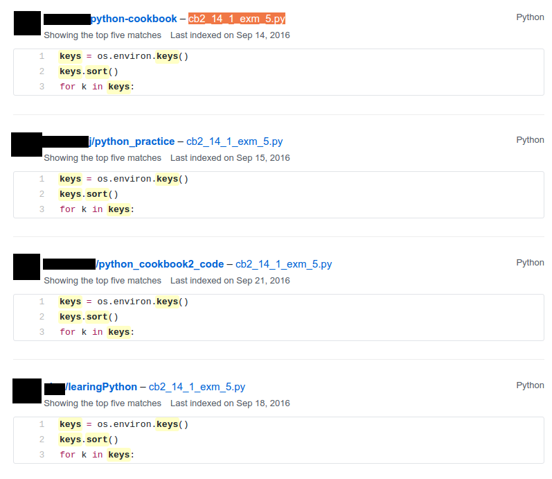

:css: css/stylesheet.css
:skip-help: true
:title: Prehistoric Patterns in Python
:auto-console: false

.. header::

    .. image:: images/shoobx.png

----

Prehistoric Patterns in Python
==============================

.. class:: name

    Lennart Regebro

PyCon US 2017, Portland

.. note::

    Hi! So yes, I'm Lennart Unpronouncable, I've been working with Python
    fulltime since 2001. Most of the time with web development.

----

.. image:: images/magda_elenor.jpg
    :class: left
    :width: 70%

.. image:: images/elenor_quince.jpg
    :class: right
    :width: 29.5%

.. image:: images/cats.jpg
    :class: left
    :width: 50%

.. image:: images/quince.jpg
    :class: right
    :width: 50%

.. note::

    I'm born in Swedish occupied territory, but I live in Poland, with my
    wife, daughter, cats and fruit trees.

----

.. class:: blurb

    Shoobx is the only comprehensive platform for incorporation, employee
    onboarding, equity management, fundraising, board & stockholder
    communication, and more.

.. note::

    I work for Boston company Shoobx. We make a webapp that helps you with a
    lot of the legal documentation for corporations.

    If you don't understand what that elevator blurb says, don't worry about
    it, your bosses will. Tell them about us.

    But enough about me!

----

.. image:: images/python-logo-1.png
    :class: left

>>
==

.. image:: images/python-logo-2.png

.. note::

    This talk is going to be about old code patterns.

    Because the standard patterns in Python has changed throughout time,
    as Python gained more features. But there is loads of old code out there,
    so I will try to explain why that old code looks like it does, and why
    you should change it.

    And old does not mean unmaintained. If you wrote a library that needed to
    support Python 2.4 old patterns may very well remain, because they still
    work. So you might very well encounter this in maintained code.

    And, old tutorials and old books have old patterns. And people keep using
    them.

    So if you are using these patterns, don't feel bad, I won't judge you.

----

.. image:: images/judge.jpg

[Yes I will]

.. note::

    Let's start! And let's start with dictionaries.

----

.. code:: python

    if mydict.has_key(x):

.. note::

    OK, firstly, stop using has_key().

----

.. code:: python

    if x in mydict:

.. note::

    This has been the norm since Python 2.2. It's been 15 years. has_key
    doesn't even exist in Python 3. Stop using has_key() on dictionaries. And
    you probably think I'm silly for mentioning this. Let me present to you,
    github!

----

.. image:: images/has_key_usage_1.png

.. image:: images/has_key_usage_2.png

.. note::

    Yes, when you search for this on github, has_key tends to show up in
    commits about every five minutes or so.

----

.. image:: images/has_key_commit_1.png
    :width: 100%

.. note::

    I even found this! But don't worry, the actual commit replaces has_key
    with in. It's just the commit message that is backwards.

    But hey, it's a dog, I'm impressed it knows git!

----

.. code:: python

        for key in mvd.keys():
            self.assertEqual(d[key], mvd[key])

.. note::

    Here is another little thing you don't need to do now: using the keys()
    method to get a list of keys.

----

.. code:: python

        for key in mvd:
            self.assertEqual(d[key], mvd[key])

.. note::

    Just skip the keys() call.

    The code I showed before is from the latest version of Django,
    but it's from a test, so...

----

.. image:: images/allowed.gif

.. note::

    In fact, if you are using the keys() method at all,
    you are probably doing it wrong.

----

.. code:: python

    keys = mydict.keys()

.. note::

    This is also fairly common. But the keys method has different results in
    Python 2.7 and Python 3.

----

.. code:: python

    keys = list(mydict)

.. note::

    This is of course nicer if you want a list. You all do this, right? No?

----

.. code:: python

    eater = iter(mydict)

.. note::

    And if you want an iterator, this is the way to do it, although you
    usually want an iterator because you want to iterate over it and you
    can iterate over a dictionary keys without calling iter() first, so...

    OK, enough about dictionaries, now let's talk about sets!

----

Sets
====

Unique values

Fast lookup

.. note::

    Sets are useful, the values in a set must be unique and lookup in sets
    are fast.

    Sets first appeared as a standard library module in Python 2.3, and
    as a built in type in Python 2.4.

    So what did you do before? What else do we have that has Unique values
    and fast lookup?

----

.. code:: python

    d = {}
    for each in list_of_things:
        d[each] = None

    list_of_things = d.keys()

.. note::

    Yes! Dictionary keys! So in fact I lied, this pattern isn't about sets,
    it's also about dictionaries!

    This code example makes a list unique by putting it into a dictionary
    as keys with a value of None, and then getting a list of keys back.

----

.. code:: python

    list_of_things = set(list_of_things)

.. note::

    Today you would just do this instead.

    Another usage of dictionary keys like this is when you wanted to do very
    fast lookups. Checking if a value exists in a dictionary is way faster
    than checking if it exists in a list.

----

``dicts`` vs ``lists``
======================

+------------+-----+
| Python 2.7 | 45x |
+------------+-----+
| Python 3.6 | 60x |
+------------+-----+
| PyPy 5.5   | 35x |
+------------+-----+

.. note::

    This is simply looking if a value exists in a dictionary vs a list.
    Data is random integers, the set is 200 random integers. Yes, just 200.

    And as you see, dictionaries are *way* faster than lists. So it
    used to be a pattern that if you needed to do that a lot, you used
    a dictionary.

    And this means that if you are making a lookup to see if some values
    exist in a list, consider that maybe it should be a set instead.

----

``sets`` vs ``dicts``
=====================

+------------+-------+
| Python 2.7 | 1.05x |
+------------+-------+
| Python 3.6 | 1.05x |
+------------+-------+
| PyPy 5.5   | 1.02x |
+------------+-------+

.. note::

    And don't worry, sets are a little bit faster than dictionaries.

    OK, enough with dictionaries for real now. Now lets talk about sorting.

----

.. note::

    Remember I mentioned old books and tutorials? Yeah, this is from the
    Python Cookbook as you can see. Probably 1st edition, from 2002. Why
    people commit it to Github in 2016 I don't know.

    Let's look at the code.

----

.. code:: python

    keys = os.environ.keys()
    keys.sort()
    for x in keys:
        print x,

.. note::

    We already talked about not using keys. But worse here is that it uses
    lists in-place-sorting sort() method. And that's because that was the only
    option in 2002. But since Python 2.4 we have the sorted() builtin.

----

.. code:: python

    for x in sorted(os.environ):
        print x,

.. note::

    Much better. Because less lines means less bugs.

    If you know that the iterable you are sorting is a list, you can sort it
    in place with .sort(). But in other cases you don't know it. And sorted()
    takes any iterable. It can be a list, or set or a generator. This makes
    the code more robust.

    Even better would have been if we could use a list
    comprehension, of course. But we can't, because of the print statement.

    Or... can we?

----

.. code:: python

    [print(x, end=' ') for x in sorted(os.environ)]

.. note::

    Of course we can, print is a function in Python 3!

----

Stuck on Python 2?
==================
Sucks for you!
==============

.. note::

    Just kidding.

----

.. code:: python

    from __future__ import print_function

    [print(x, end=' ') for x in sorted(os.environ)]

.. note::

    You *can* do this in Python 2 as well.

    Calling sort() on an existing list is a little bit faster than calling
    sorted on the list, since sorted() ends up creating a new list. But the
    difference is very small, around 2%, less on PyPy.

----

.. code:: python

    candidates.sort(lambda a, b: -cmp(a[1], b[1]))

.. note::

    However, the next old sorting pattern *is* all about speed. For that
    reason it's the one that you are least likely to encounter, because
    fixing it is a marked improvement. But that also means it's important
    to fix it, so I will talk about it anyway.

    This code, from a book about Django and Javascript, uses the standard way
    of sorting a list by passing in a comparison function, in this case a
    lambda.

    comparison functions return 1, 0 or -1 to tell which item of the two is
    larger, so by sticking a minus first you get a reverse sort.

----

+--------+---------+----------+
| len(l) | # calls | Per item |
+--------+---------+----------+
| 4      | 6       | 1.5      |
+--------+---------+----------+
| 10     | 22      | 2.2      |
+--------+---------+----------+
| 100    | 528     | 5.28     |
+--------+---------+----------+
| 40,000 | 342,541 | 8.56     |
+--------+---------+----------+

.. class:: ref

    Reference: Jarret Hardie in Python Magazine

.. note::

    Buuuut, the comparison function compares pairs, and the longer the list is,
    the more possible pairings is there.

    Jarret Hardie in the sadly defunct Python Magazine wrote an article on this
    and this is his numbers, and they sound reasonable. You see that long
    lists quickly gets very slow to sort.

----

.. code:: python

    candidates.sort(key=lambda a: a[1], reverse=True)

.. note::

    So therefore, a key argument to sort() and sorted() was introduced
    already in Python 2.4.

    The function now got much simpler, and has only one argument    .
    But how does the statistics look for how many calls the function gets?

----

+--------+---------+----------+
| len(l) | # calls | Per item |
+--------+---------+----------+
| 4      | 4       | 1        |
+--------+---------+----------+
| 10     | 10      | 1        |
+--------+---------+----------+
| 100    | 100     | 1        |
+--------+---------+----------+
| 40,000 | 40,000  | 1        |
+--------+---------+----------+

.. note::

    Yeah, you get exactly one call per item, always.
    With the earlier code, we get in average 680,000 calls to the
    modified() method when sorting 40.000 items.

    And the lambda only does one key lookup, not two, so we get 1/17th as
    many key lookups on a list with 40.000 items. This makes sorting much
    faster. 40.000 random integers take only around 20% of the time to sort.

----

.. code:: python

    class MyClass(object):

        def __cmp__(self, other):
            return cmp(self.value, other.value)

.. note::

    Another thing that's deprecated is dunder cmp. This is gone in Python 3,
    it's not used. Instead there are the so called "rich comparison
    functions."

----

.. code:: python

    class MyClass(object):

        def __lt__(self, other):
           ...
        def __le__(self, other):
           ...
        def __gt__(self, other):
           ...
        def __ge__(self, other):
           ...
        def __eq__(self, other):
           ...
        def __ne__(self, other):
           ...

.. note::

    There are plenty of reasons to use these instead of __cmp__, like the
    fact that some types may tested for equality, but not otherwise
    comparable. You can for example test if a color is the same as another
    color but which of the colours are bigger? There's no real answer there.

    But __cmp__ has a big benefit, you only need to implement one method, not
    six.

----

.. code:: python

    from functools import total_ordering

    @total_ordering
    class MyClass(object):

        def __lt__(self, other):
           ...
        def __eq__(self, other):
           ...

.. note::

    Functools to the rescue. With total_ordering you only need to implement
    __eq__ and either less than or greater than.

    And if you still aren't convinced about not using __cmp__ and not using
    list.sort(), consider this code, that I encountered on github.

----

.. code:: python

    def __cmp__(self, other):
        return (self.dict.keys().sort() ==
                other.dict.keys().sort())

.. note::

    I guess the poor soul that wrote this will sooner or later wonder why
    all his objects are equal to each other. Ah well.

    That's it for sorting. Next pattern!

----

.. code:: python

    result = include_blank and blank_value or []

.. note::

    This looks like a logic expression, but it isn't. It's a sneaky
    conditonal!

    It means that if include_blank is True, then result
    gets set to blank_value other wise it's an empty list.

    But blank_value was a parameter. What if it is something that evaluates to
    false, like a None or an empty set?

    Yes: result will be an empty list, not what you pass in as blank_value.

----

.. code:: python

    result = blank_value if include_blank else []

.. note::

    This is how to do a conditional expression. It only arrived in Python 2.5,
    because people couldn't agree on how it should look, and from what I
    understand Guido didn't like any of the proposals.

    And I agree it's not very readable, but his hand was forced, because
    people would make these sneaky conditionals instead, so he then chose the
    most pythonic form. And it's a bit weird, as the if statement comes in the
    middle. But we're used to it now. :-)

    Now, on to something slightly more complex, resource handling!

----

.. code:: python

    t = database.start()
    try:
        try:
            t.insert(a_bunch_of_records)
            t.commit()
        except DatabaseException:
            log.exception("Something went wrong!")
            t.abort()
    finally:
        t.close()

.. note::

    Yeah, this also isn't very readable. It's a made up example, of course,
    no maintained code would still do this. But you might encounter it in
    some old app somewhere, and more problematic, there are still tutorials
    around that do things that are similar to this.

    And what the code does, is that it does resource handling. We make sure
    that the database transaction is aborted if something goes wrong, and
    that it's closed at the end.

    Context managers happened in Python 2.5 and try/except/finally also
    happened in 2.5. Before that you had to nest one try/except inside a
    try/finally, like this code, and it's those nested try statements that make
    this code ugly.

----

.. code:: python

    t = database.start()
    try:
        t.insert(a_bunch_of_records)
        t.commit()
    except DatabaseException:
        log.exception("Something went wrong!")
        t.abort()
    finally:
        t.close()

.. note::

    Already this is better.

----

.. code:: python

    with database.start() as t:
        try:
            t.insert(a_bunch_of_records)
            t.commit()
        except DatabaseException:
            log.exception("Something went wrong!")
            t.abort()

.. note::

    But of course, even better is with a context manager.
    I like context managers.

----

.. code:: python

    class MagicResource(object):

        def __del__(self):
            # deallocate the object!

.. note::

    Here's another example of something people did, especially influenced by
    Java and C++. This was never a good idea, as __del__ isn't guaranteed to
    be called. A context manager would be the solution instead.

    For the reason that it never was a good idea, I thought deallocating things
    in dunder del would be unusual.

----

.. image:: images/del_use1.png

.. note::

    Boy was I wrong.

----

.. code:: python

    self.assertRaises(DatabaseException, add_records,
                      arg1, arg2, keyword=True)

.. note::

    On the topic of context managers, unittests assertRaises is a
    contextmanager in 2.7 and later.

----

.. code:: python

    with self.assertRaises(DatabaseException):
        add_records(arg1, arg2, keyword=True)

.. note::

    So much nicer.

----

.. code:: python

    import tempfile

    with tempfile.TemporaryDirectory() as dir:
        # Do stuff

.. note::

    Also worth mentioning is that in Python 2.7 TemporaryFile and
    NamedTemporaryFile are context managers. And in Python 3.2 and later
    you also have TemporaryDirectory!

----

Stuck on Python 2?
==================
Sucks for you!
==============

.. note::

    Next: Generators.

----

.. code:: python

    def a_generator():
        for x in another_generator():
            yield x

.. note::

    Generators are awesome, I love generators. But this sort of code annoys
    me every time. Why do I have to write such stupid code?

----

.. code:: python

    def a_generator():
        yield from another_generator()

.. note::

    In Python 3.3 and later, I don't!

----

Stuck on Python 2?
==================
Sucks for you!
==============

.. note::

    Now this is not the only thing yield from does. It also changes how you
    use coroutines.

    But coroutines really require their own talk, but the most important for
    this is that without yield from it's very hard to yield from a
    subgenerator with Python coroutines.

    It's in fact so hard that I can't even find a single example of it being
    done without yield from. Python 2 coroutine example, yep, I can find that.
    Python 2 coroutines with subroutines? *can't find em*

    But it requires you to do a lot of exception handling and closing of the
    subroutine etc. Yield from does all that for you, it will let a subroutine
    yield data directly to the called of the coroutine the correct way.

----

.. code:: python

    async def http_get(domain):
        reader, writer = await asyncio.open_connection(domain, 80)

.. note::

    And of course, Python 3.4 includes asyncio, and Python 3.5 makes it
    even easier and nicer to use with the new async def and await keywords.

    I've just started playing with this in a future version of Hovercraft!,
    the presentation software I use for this talk, and where I before needed
    tricky process handling that wouldn't alway exit correctly on ctrl-C etc,
    asyncio seems to make all this so much simpler and robust.
    We'll see, I'm gonna work on it during the sprints.

    On the topic of Generators and coroutines, Python 3.7 will have a
    backwards incompatible change I thought I should mention.

----

.. code:: python

    def __next__(self):
        x = self.foo()
        if x == 0:
            raise StopIteration
        return x

.. note::

    Generators are a type of iterators, and iterators is any object with a
    __next__ method. You signal the end of the iteration by raising a
    StopIteration exception.

----

.. code:: python

    def testgen(x):
        while x < 100:
            if x == 31:
                raise StopIteration
            x += 1+x
            yield x

.. note::

    And so you should use StopIteration to stop the iteration ins a generator
    as well, right? They are after all just fancy iterators, or?

    Ah, well, no. This above does indeed work. But raising StopIteration in
    generators can under specific circumstance cause some obscure bugs.

----

PEP 479
=======

.. note::

    See PEP 479 if you want the details.

----

.. code::

    >>> list(testgen(0))
    RuntimeError: generator raised StopIteration

.. note::

    The end result is in any case that starting from Python 3.7, raising a
    StopIteration in a generator in fact raises a RuntimeError.

----

.. code:: python

    def testgen(x):
        while x < 100:
            if x == 31:
                return
            x += 1+x
            yield x

.. note::

    The correct way is to just return. Returning from a generator in fact
    raises StopIteration.

----

.. code:: python

    self._leftover = b''.join([bytes, self._leftover])

.. class:: ref

    Django 1.11.1: django/http/multipartparser.py

.. note::

    And now, the prehistoric pattern that was the catalyst for this talk.
    Concatinating strings by joining an empty string, like this example
    from Django.

    It's obvious it's old code, they have a variable called bytes.

----

.. code:: python

    self._leftover = bytes + self._leftover

.. note::

    Why not do this instead?

    Well, you used to hear people claiming that concatenating strings with +
    is slow, and that doing a join is faster. But, they say, since CPython
    2.5 there are optimizations in string concatenation, so now it is fast, I
    was told.

    So let's look at the benchmarks.

----

``__add__`` vs ``.join``
========================

+------------+-------+
| Python 2.4 | 1.5x  |
+------------+-------+
| Python 2.7 | 1.4x  |
+------------+-------+
| Python 3.3 | 1.3x  |
+------------+-------+
| PyPy 5.5   | 1.07x |
+------------+-------+

.. note::

    These benchmarks have been a big problem. It's been very hard to get
    something sensible, simple, that measures actual concatention, and
    doesn't get completely optimized away by PyPy.

    And this is the best I can do. It adds strings between 0 and 999
    characters long. There is overhead in the tests, but I believe that it's
    not enough to make a significant difference to the numbers.

    And you see that using addition to concatenate is faster.
    Even on Python 2.4! So using join() was never faster!

    So where does this claim that join is faster come from?
    I think this is a big misunderstandning.

----

The Misunderstanding
====================

This is slow:

.. code:: python

    result = ''
    for text in make_a_lot_of_text():
        result = result + text
    return result

.. note::

    This code will be slow, but...

----

The Misunderstanding
====================

Much faster:

.. code:: python

    texts = make_a_lot_of_text()
    result = ''.join(texts)
    return result

.. note::

    This code will be fast.

----

``__add__`` vs ``.join``
========================

+------------+--------+
| Python 2.4 | 0.5x   |
+------------+--------+
| Python 2.7 | 0.5x   |
+------------+--------+
| Python 3.3 | 0.5x   |
+------------+--------+
| PyPy 5.5   | 0.002x |
+------------+--------+

.. note::

    Twice as fast, in fact. And this is with native strings, so Unicode
    on Python 3. On Python 2 the difference is much bigger with Unicode,
    and weirdly, the difference is much bigger with bytes on Python 3.

    PyPy doesn't care much if it's bytes or strings join is somewhere between
    400 and 1500 times faster.

----

Many Copies
===========

.. code:: python

    result = ''
    for text in make_a_lot_of_text():
        result = result + text
    return result

.. note::

    And the reason is that Strings are immutable! This code creates a new
    string and then copies the two input strings into that new string, once
    for every loop. That's a lot of string creations and a lot of string
    copying. And the first string will be copied over and over.

----

ONE COPY!
=========

.. code:: python

    texts = make_a_lot_of_text()
    result = ''.join(texts)
    return result

.. note::

    Here we only make one new string, and copy each string in the list into
    that string. Each string gets copied only once, and only one new string
    is created.

----

The Misunderstanding
====================

.. code:: python

    self._leftover = bytes + self._leftover

.. note::

    But this also only copies each of the strings once. The optimization of
    using join isn't relevant here.

    So if adding strings are fast when you are adding two strings, and
    joining is fast if you have many strings, where is the breakpoint?

    Well, it depends. It depends on how long your strings are and how many
    you have. With typical cases it seems join() is faster on CPython
    at somewhere around 4-5 strings.

    With PyPy up to ten strings are still as fast to use addition as to use
    join, and I stopped testing there because it was getting silly.

    The conclusion is that you should do what feels natural. If the easiest
    way to concatenate a bunch of strings is by using +, then do that. If the
    strings you have are in a list or generated in a loop, then use join.

----

Constants and Loops
===================

.. code:: python

    const = 5 * 3.5
    result = 0
    for each in some_iterable:
        result += const

.. note::

    This is a pattern that was suggested to me that I should bring up.
    And I wasn't going to do it until I started benchmarking it.

    Here we see something simple, calculating a constant outside the loop.
    That should speed up the loop, right because you don't have to calculate
    the constant, right?

----

Outside vs Inside
=================

``5 * 3.5``
-----------

+------------+------+
| Python 2.4 | 2.0x |
+------------+------+
| Python 2.7 | 1.0x |
+------------+------+
| Python 3.3 | 1.0x |
+------------+------+
| PyPy  5.4  | 1.0x |
+------------+------+

.. note::

    Well, kinda. It used to be much faster, but since Python 2.5 it isn't.
    CPython will find that multiplication and calculate only once.

    PyPy of course is ridicolously fast with this code, it does this some
    30-40 times faster than Python 2.7.

----

Outside vs Inside
=================

``5 / 3.5``
-----------

+------------+------+
| Python 2.4 | 2.0x |
+------------+------+
| Python 2.7 | 2.0x |
+------------+------+
| Python 3.3 | 1.0x |
+------------+------+
| PyPy 1.9   | 1.0x |
+------------+------+
| PyPy 5.5   | 2.6x |
+------------+------+

.. note::

    So if you have a division in the calculation, the Python 2.7
    gets slow again!

    Python 3.3 and PyPy are still fine, though.

    But of course, my example is stupid. 5 * 3.5 is actually 17.5, so when you
    have constants, you can simply change the code to the constant! Problem solved!

----

``result = len(some_iterable) * 17.5``

.. note:

    And it can be replaced with this. Which is about 250 times faster. Except
    on PyPy where it's just 10 times faster. Which is still twice as fast as
    Python 2.7.

    So, let us take some less stupid example.

----

Outside vs Inside
=================

.. code:: python

    const = 5 * a_var
    result = 0
    for each in some_iterable:
        result += each * const

.. note::

    Here the constant is "semi-constant" and we multiply with each item in
    the iterable. This makes more sense.

----

Outside vs Inside
=================

``each * 5 * a_var``
--------------------

+------------+------+
| Python 2.4 | 1.3x |
+------------+------+
| Python 2.7 | 1.3x |
+------------+------+
| Python 3.3 | 1.3x |
+------------+------+
| PyPy 5.5   | 1.0x |
+------------+------+

.. note::

    Now the optimization dissappeared. Calculating the constant outside
    of the loop is now faster again.

    Except on PyPy which still succeeds in optimizing this.

----

Outside vs Inside
=================

``each * 5 ** a_var``
---------------------

+------------+------+
| Python 2.4 | 1.8x |
+------------+------+
| Python 2.7 | 2.0x |
+------------+------+
| Python 3.3 | 2.0x |
+------------+------+
| PyPy 5.5   | ~30x |
+------------+------+

.. note::

    Unless you use a power in the calculation of the constant,
    where PyPy's optimization also dissapears to the point of calculating it
    inside the loop is around 30x slower!

    So this pattern turns out not to be prehistoric at all!

    So, you *should* calculate constants outside of the loop.

    And it's the same with calculating constants outside of the loop.
    It feels like it should be faster, and it often is. Python is such
    a fantastic language partly because what intuitively feels like the
    right thing to do, tends to in fact be the right thing to do.

----

Thanks!
=======

Thanks to everyone who suggested outdated idioms, even if I didn't include them:

Radomir Dopieralski,
James Tauber,
Sasha Matijasic,
Brad Allen,
Antonio Sagliocco,
Doug Hellman,
Domen Kožar,
Christophe Simonis

Made with Hovercraft!
---------------------

----

End
===
